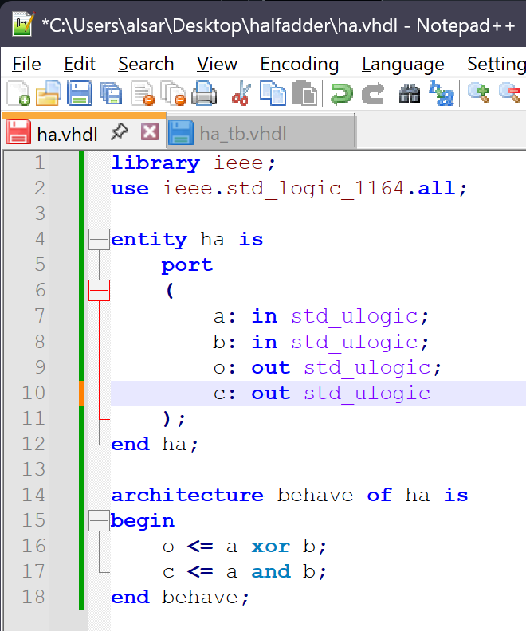
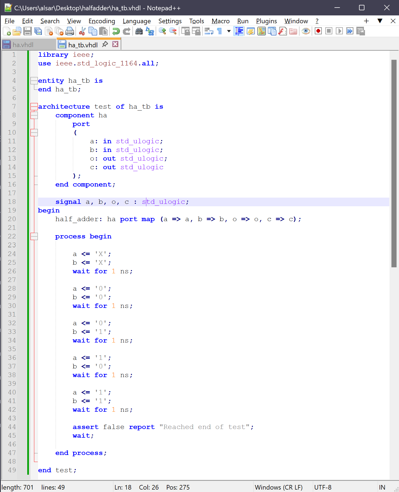
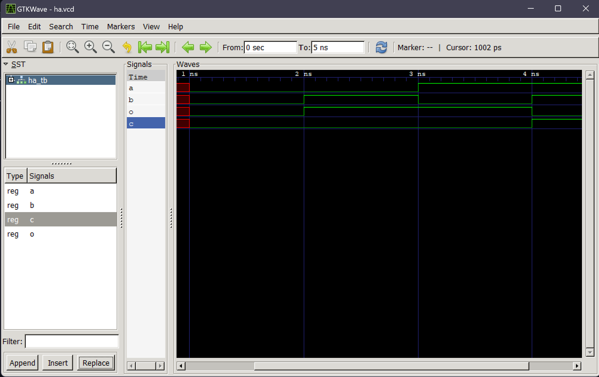
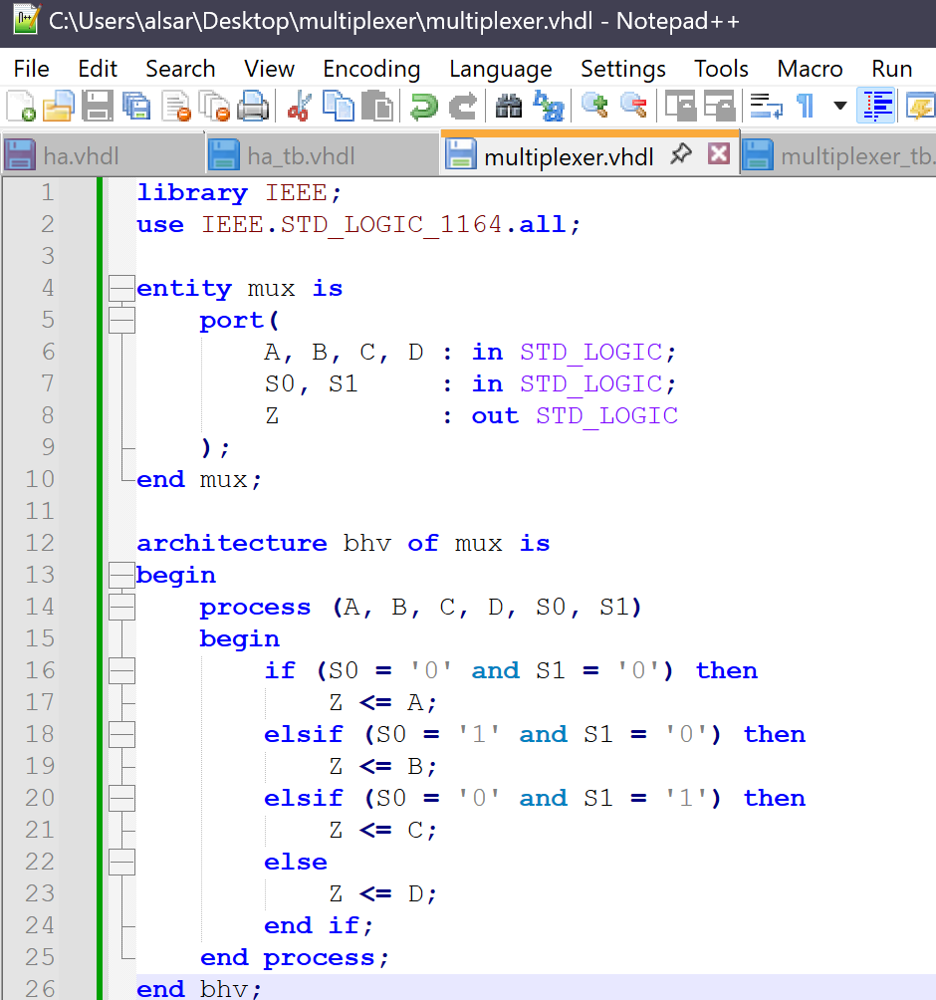
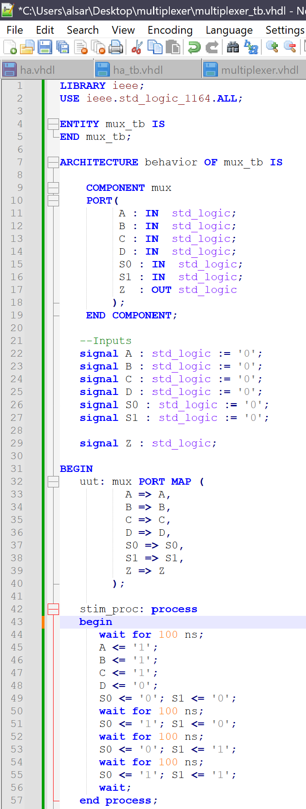
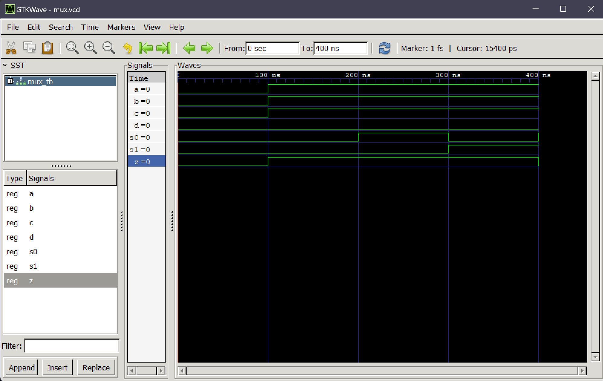

# Lab 1: GHDL and GTKWave

---

## Half Adder Example

### ha.vhdl

This VHDL module defines a half adder circuit using two logic gates:
- XOR to compute the sum bit o
- AND to compute the carry bit c

---

### ha_tb.vhdl

The testbench provides inputs to the half adder and verifies the output for all input combinations (00, 01, 10, 11). It also includes an assertion to stop simulation after the final test case.

---

### GTKWave Output for Half Adder

This waveform confirms the expected results from the half adder:
- When inputs are 00, sum and carry are 0
- When inputs are 01 or 10, sum is 1, carry is 0
- When inputs are 11, sum is 0, carry is 1

---

## 4-to-1 Multiplexer Example

### multiplexer.vhdl

This is the main logic of the 4-to-1 multiplexer. It routes one of four inputs (A, B, C, D) to the output Z depending on the selector bits S0 and S1.

---

### mux_tb.vhdl

---

### GTKWave Output for 4-to-1 Multiplexer

The waveform shows the result of switching between inputs using selector bits:
- S0=0, S1=0 → Z=A (Z=1)
- S0=1, S1=0 → Z=B (Z=1)
- S0=0, S1=1 → Z=C (Z=1)
- S0=1, S1=1 → Z=D (Z=0)

---

I pledge my honor that I have abided by the Stevens Honor System. YA
