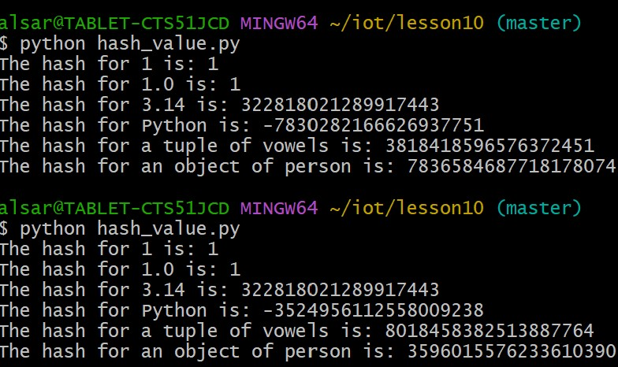
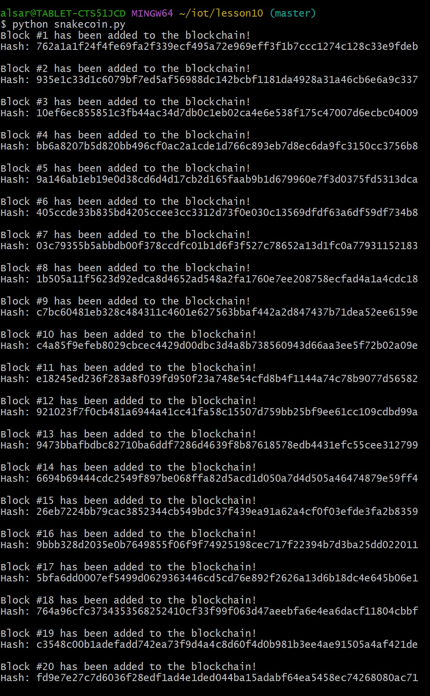
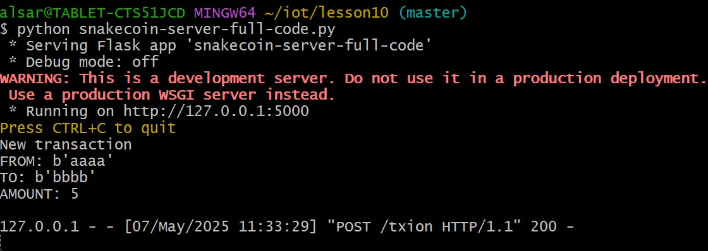
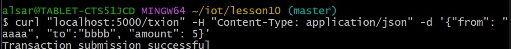
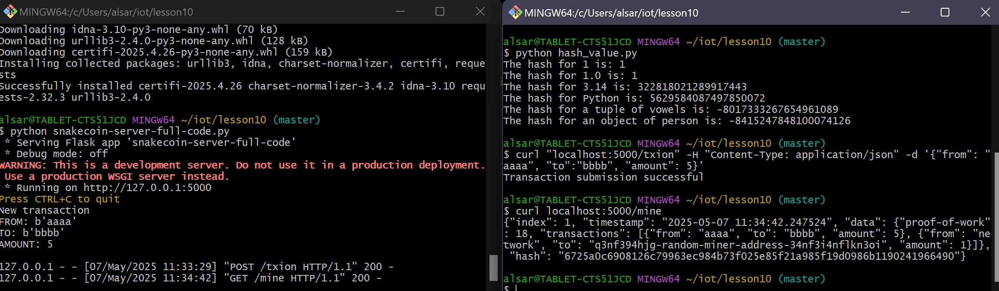
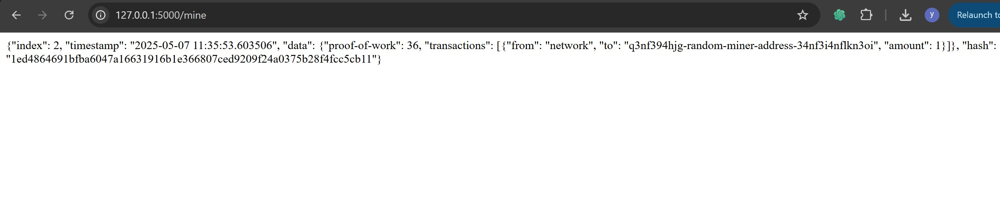
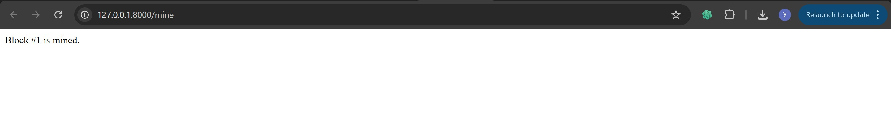
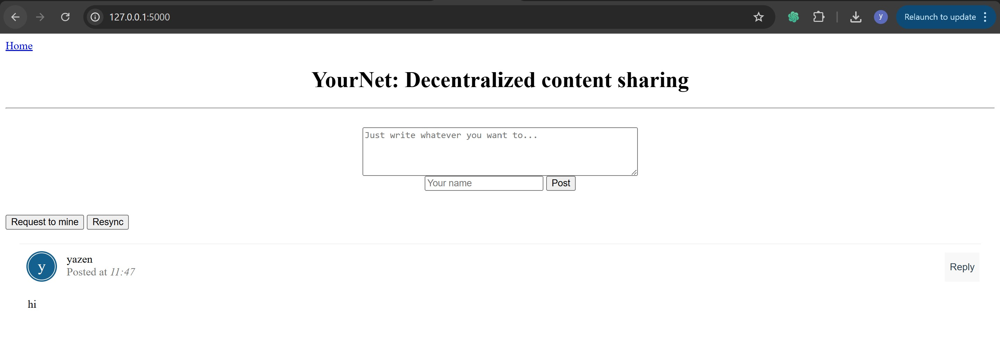

# Lab 10: Blockchain

## Hashing

Hashing secures and verifies data by converting it into a unique value. The file hash_value.py demonstrates hashing on various types of inputs.

---

## python hash_value.py

---

## Blockchain

snakecoin.py simulates a simple blockchain by adding new blocks with unique hashes. Each block confirms the previous one, forming a secure chain.

Running this script produces a long list of blocks being added to the chain.

---

## Transaction

Starts the blockchain server on localhost, allowing you to post transactions and mine blocks via a client.

---

## Requesting

A new transaction is submitted with curl and successfully mined afterward.

---

## Mined Block

After mining, the mined block and transaction are confirmed.

---

## Web Interaction

---

## Web Server Creation

---

## Sites

---
I pledge my honor that I have abided by the Stevens Honor System. YA
