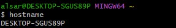
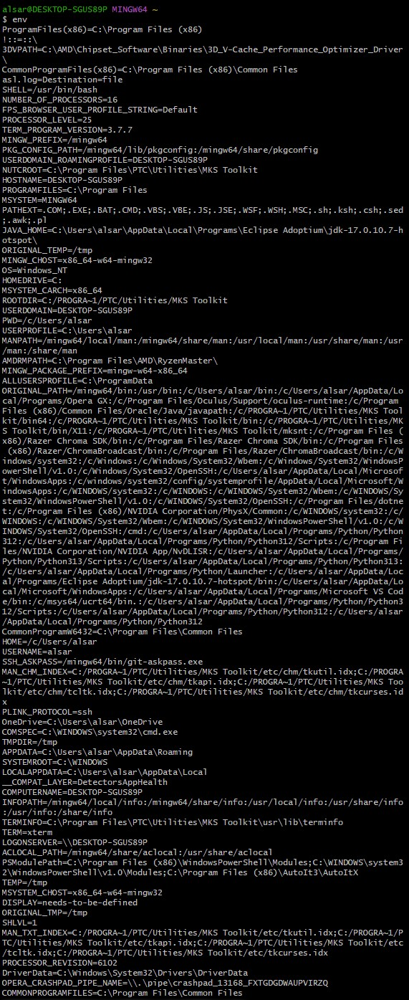
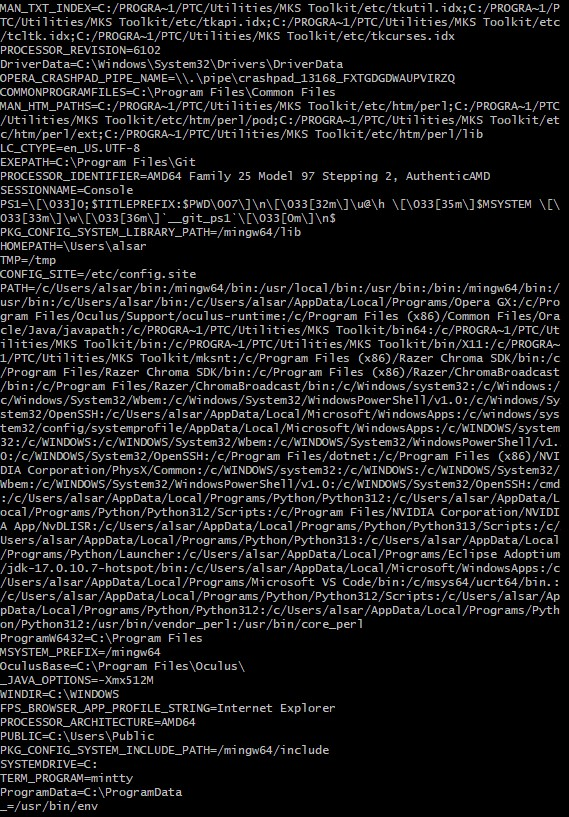
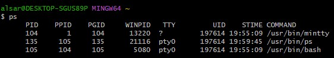
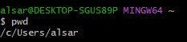
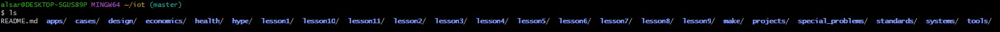
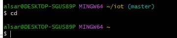
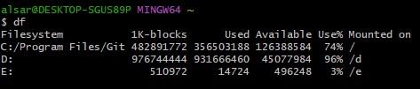
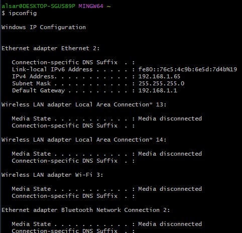
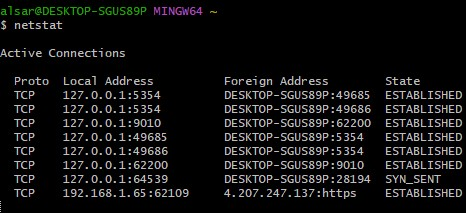

# Lab 2: Command Line

## Overview
This lab was mostly practice on Git Bash using Bash commands.

---

## hostname
The hostname command displays the name of the device on the network.

---

## env
env command pritns all environment variables

---

## ps
ps shoiws list of currently running processes.

---

## pwd
Print working directory, shows which directory we're working in.

---

## git clone
git clone is used to download a copy of a GitHub repository.

---

## cd iot
change directory, this brings us to the iot directory.

---

## ls
Lists everything inside the current directory

---

## cd
cd brings you back to your home directory.

---

## df
df shows current disk space.

---

## mkdir demo
Creates a new directory named demo

---

## cd demo
Navigates to demo

---

## nano file
Opens a tmerinal text editor.

---

## cat file
Allows us to read and write files, reads the txt file we just created in this case.

---

## cp file file1
Duplicates the file

---

## mv file file2
Moves contents of a file to another. File 1 to file 2.

---

## rm file2
Deletes a file, deleted file 2.

---

## clear
Clears the terminal

---

## man uname
Opens a manual of specified command. I used --help since the man command was not working.

---

## uname -a
Prints available system info

---

## ifconfig / ipconfig
Chekcs all network parameters

---

## ping localhost
Tests connectivity over a network.

---

## netstat
Shows all TCP connections.

---

I pledge my honor that I have abided by the Stevens Honor System. YA
