# Lab 3: Python Functions via Bash

## Overview
In this lab, we explored different Python packages and scripts to test different functions. We used Git Bash to interact with the various libraries and system-level data. We practiced using external packages like `geopy`, `astral`, `jdcal`, and Python's built-in `datetime` tools to gather system and geographic information.

---

## cd ~/iot
Changes the directory to iot github.

---

## cd *3
Takes us to the lesson 3 directory.

---

## python3 julian.py
This script returns the Julian Date and Modified Julian Date for the current calendar day.

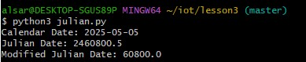

---

## python3 date_example.py
This file outputs the current date and the time point we're in throughout the semester.

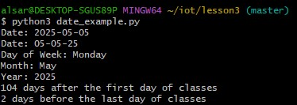

---

## python3 datetime_example.py
This script prints the time and date repeatedly.

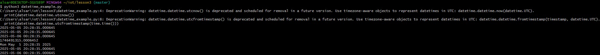

---

## python3 time_example.py
System time printed at 10-second intervals.

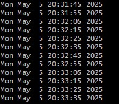

---

## python3 sun.py "New York"
This shows sunrise/sunset data for New York.

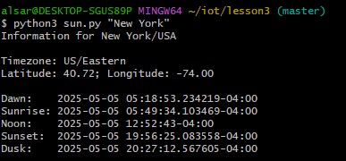

---

## python3 moon.py
This outputs the moon phase for each day over a month.

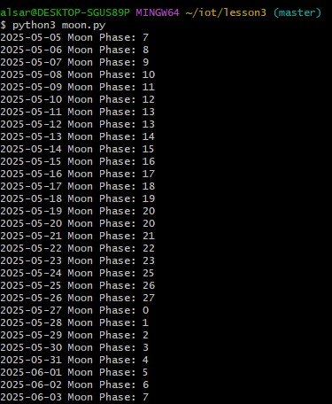

---

## python3 coordinates.py "Samuel C. Williams Library"
Prints coordinates for the library.

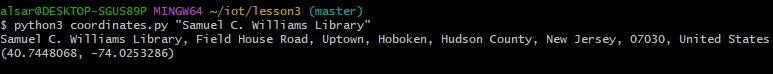

---

## python3 address.py "40.74480675, -75.012532861159351"
Takes coordinates and prints out the address corresponding to the coordinates.

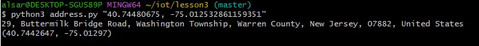

---

## python3 cpu.py
This script shows the number of physical and logical CPU cores as well as the utilization.

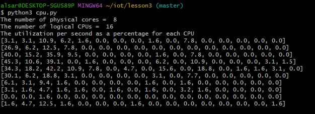

---

## python3 battery.py
Checks battery status. In this case, there was no battery detected since this was on a desktop, so it returned "None."

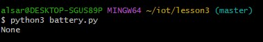

---

## python3 documentstats.py document.txt
Processes a text file, giving a word count and the top 10 most frequently used words in the file.

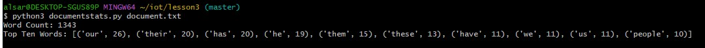

---

I pledge my honor that I have abided by the Stevens Honor System. YA

