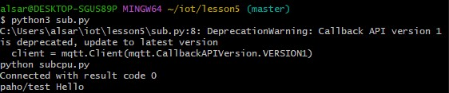
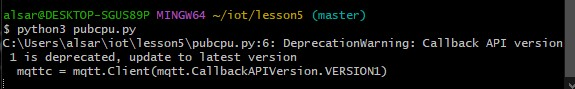

# Lab 5: Paho-MQTT

## Overview  
This lab explored message communication using the Paho-MQTT protocol, which allows one program to publish data and another to subscribe to and receive it in real-time.

Before getting started, I installed the necessary paho-mqtt Python package and made sure my local repository was updated using git pull.

---

## Paho testing
The Paho-MQTT library must be installed first to allow Python to publish and subscribe to MQTT topics. Here I was just testing the sub.py and got Hello World to print.

---

## pub.py  
This script sends live CPU usage percentages with timestamps to a given MQTT topic. It acts as the publisher in the communication model. I got it to connect here.

---

## pubcpu.py  
In the bottom two screenhots, the CPU utilziation of my computer was able to be communicated and transfered between the publisher and the subscriber.

---

## subcpu.py

---

I pledge my honor that I have abided by the Stevens Honor System. YA
