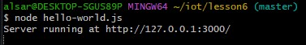

# Lab 6: Node.js and Pystache

## Overview
This lab introduced the use of Node.js and Pystache. Node.js allows us to run JavaScript code on the server-side, which is very useful for developing web applications. Pystache is a lightweight Python library for using Mustache templates—great for generating formatted text like HTML.

---

## Node.js Setup
To begin, I installed Node.js from the official website. This enabled me to run JavaScript files directly from the terminal.

---

## hello-world.js
This file starts a basic web server and displays "Hello, World!" in the browser.

  


---

## hello.js
This version uses a different port and logs activity whenever a request is sent or completed. Every page refresh adds new log lines in the terminal.

  


---

## http.js
This script keeps count of how many times the page has been refreshed. It displays that count both in the browser and in the terminal.

  


---

## Pystache Setup
To use Pystache, I installed it with the following command:

```bash
pip install pystache
```
---

## say_hello.py
This script uses the say_hello.mustache template to generate several Hello messages.


---

I pledge my honor that I have abided by the Stevens Honor System. YA
