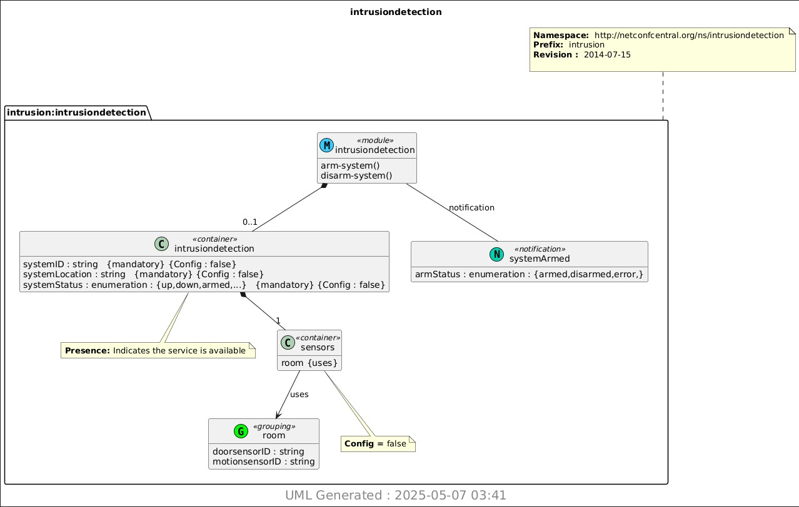

# Lab 9 - YANG

## Overview  
This lab explored YANG schemas and model-to-model transformations using the Pyang and PlantUML tools. We practiced converting .yang files into .yin and .uml formats, then rendered UML diagrams from those models.

---

## YANG
Displaying the YANG file using the cat command resulted in this following output:

---

## YANG to YIN 
Converts the YANG file into its equivalent YIN XML-based structure.

---

## UML file generation
Generates UML file from the YANG module using Pyang.

---

## UML file to PNG
This command uses PlantUML to render the UML diagram as an image from the generated .uml file.

---

I pledge my honor that I have abided by the Stevens Honor System. YA
